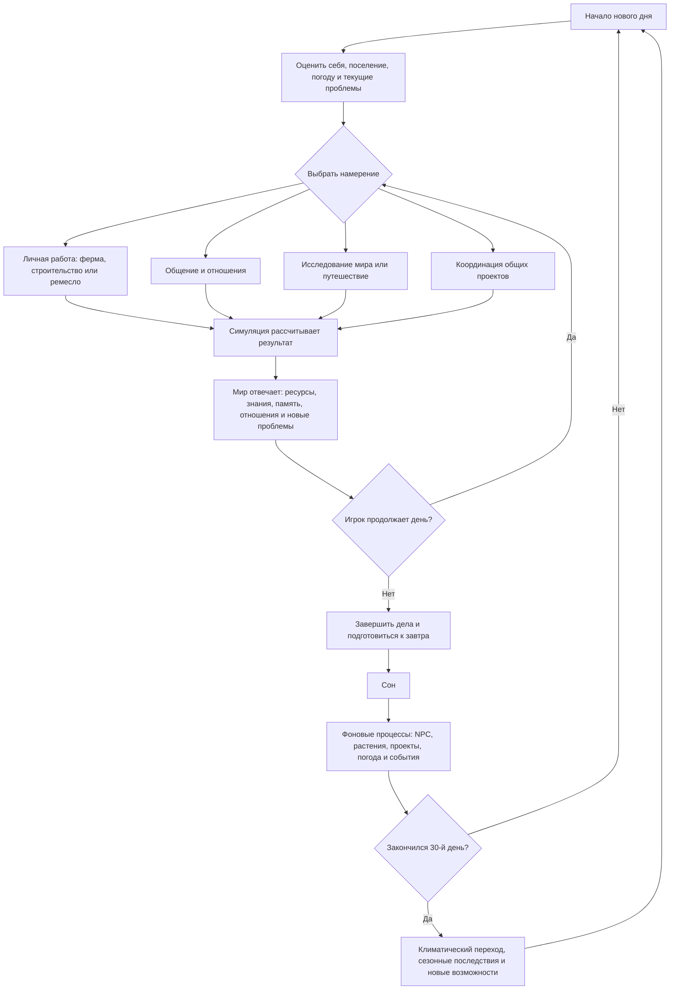

# Черновик основного игрового цикла

**Статус:** гипотеза для совместного редактирования.

Диаграмма показывает ритм одного дня и связь ежедневных действий с сезонными изменениями. Она намеренно не определяет конкретные кнопки, награды и обязательные занятия.

## Что здесь нужно решить

1. Достаточно ли четырёх основных направлений действий или некоторые нужно объединить?
2. Должен ли день начинаться с обязательной проверки состояния или игрок сразу получает управление?
3. Какие последствия игрок видит немедленно, а какие проявляются позднее?
4. Может ли сон быть выбран в любое время и что мешает использовать его для слишком быстрого пропуска сезона?
5. Какие события создают недельный ритм между отдельным днём и 30-дневным сезоном?

## Критерий хорошего цикла

В каждый момент у игрока есть несколько понятных и эмоционально разных вариантов, но нет требования ежедневно выполнять все системы. Пропущенное занятие создаёт последствия или возможности, а не просто наказывает за несоблюдение оптимального расписания.
