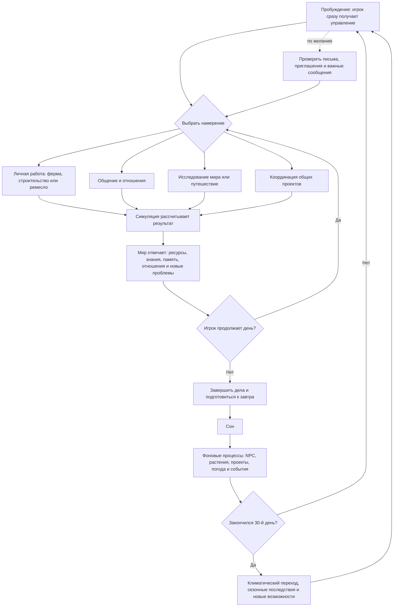

# Черновик основного игрового цикла

**Статус:** гипотеза для совместного редактирования.

Диаграмма показывает ритм одного дня и связь ежедневных действий с сезонными изменениями. Она намеренно не определяет конкретные кнопки, награды и обязательные занятия.

## Принято

- Четыре направления остаются широкими ориентирами и могут пересекаться.

## Рабочая версия

- Игрок получает управление сразу после пробуждения.
- Ночного отчёта или обязательного списка проверки нет.
- Важная отложенная информация может появляться на столе с письмами.
- Сон зависит от накопленной сонливости, поэтому сразу повторно завершить день нельзя.

## Ещё нужно решить

1. Какие последствия должны быть заметны немедленно, а какие раскрываются позднее?
2. Как именно рассчитывается сонливость и допустим ли дневной сон?
3. Какие хозяйственные и общественные события создают ритм между отдельным днём и 30-дневным сезоном без перегрузки календаря?

## Критерий хорошего цикла

В каждый момент у игрока есть несколько понятных и эмоционально разных вариантов, но нет требования ежедневно выполнять все системы. Пропущенное занятие создаёт последствия или возможности, а не просто наказывает за несоблюдение оптимального расписания.
